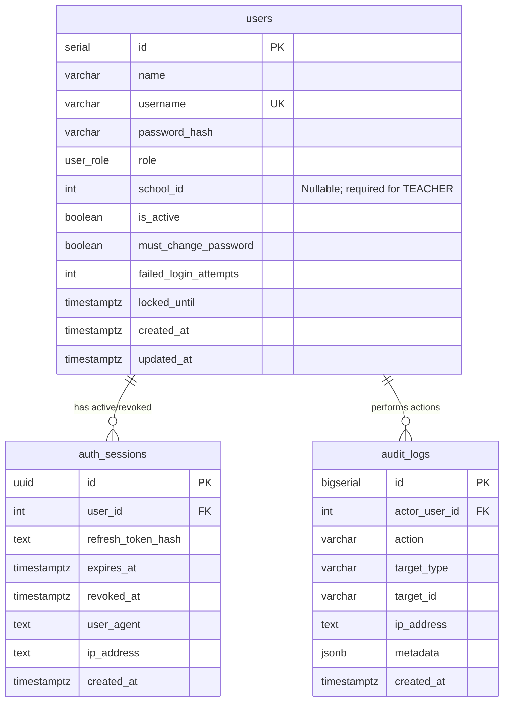
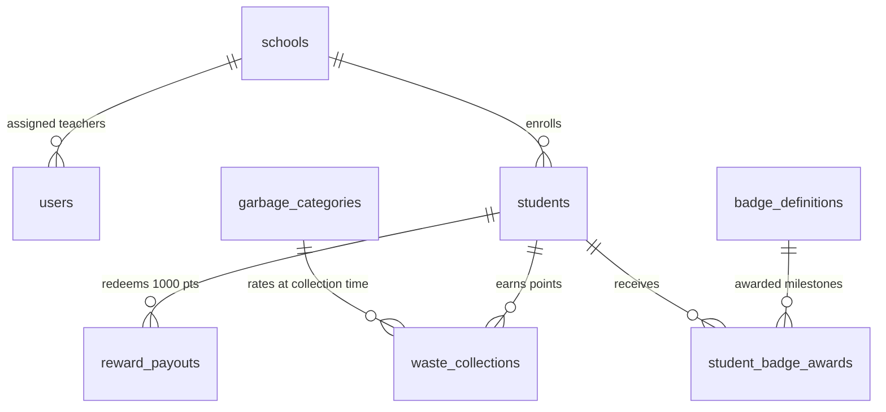

# Database Entity-Relationship Diagrams

## 1. Authentication, Sessions & Audit Schema (Implemented)

```mermaid
erDiagram
    users ||--o{ auth_sessions : "has active/revoked"
    users ||--o{ audit_logs : "performs actions"

    users {
        serial id PK
        varchar name
        varchar username UK
        varchar password_hash
        user_role role
        int school_id "Nullable; required for TEACHER"
        boolean is_active
        boolean must_change_password
        int failed_login_attempts
        timestamptz locked_until
        timestamptz created_at
        timestamptz updated_at
    }

    auth_sessions {
        uuid id PK
        int user_id FK
        text refresh_token_hash
        timestamptz expires_at
        timestamptz revoked_at
        text user_agent
        text ip_address
        timestamptz created_at
    }

    audit_logs {
        bigserial id PK
        int actor_user_id FK
        varchar action
        varchar target_type
        varchar target_id
        text ip_address
        jsonb metadata
        timestamptz created_at
    }
```

## 2. School Waste Rewards Schema (Planned Next)

```mermaid
erDiagram
    schools ||--o{ users : "assigned teachers"
    schools ||--o{ students : "enrolls"
    students ||--o{ waste_collections : "earns points"
    garbage_categories ||--o{ waste_collections : "rates at collection time"
    students ||--o{ reward_payouts : "redeems 1000 pts"
    badge_definitions ||--o{ student_badge_awards : "awarded milestones"
    students ||--o{ student_badge_awards : "receives"
```
